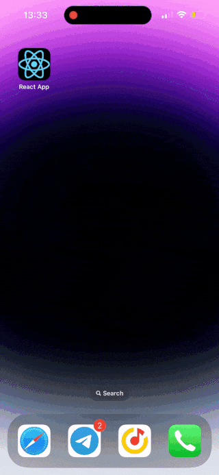

[](https://badge.fury.io/js/react-pwa-push-notifications)
# React hook Push Notifications

## Overview

This package provides a custom React hook for facilitating push subscriptions in your application. It ensures proper handling of browser APIs and returns easy-to-handle errors in case of issues.


## Installation

```bash
npm install react-pwa-push-notifications
```

## Usage

We will be using a library for Node.js called [web-push](https://github.com/web-push-libs/web-push). This library works well with Google Cloud Messaging, a system from Google for sending notifications.
A detailed setup process can be read in this [article](https://dev.to/u4aew/how-to-set-up-push-notifications-in-safari-on-ios-ki9).

```javascript
npm install web-push -g
```

```javascript
web-push generate-vapid-keys
```

```typescript
import { useSubscribe } from "react-pwa-push-notifications";
// Import the useSubscribe function and set the public key (PUBLIC_KEY)
const { getSubscription } = useSubscribe({publicKey: PUBLIC_KEY});

// Handler for subscribing to push notifications
const onSubmitSubscribe = async (e) => {
    try {
        // Retrieve the subscription object using the getSubscription function
        const subscription = await getSubscription();

        // Send the subscription object and ID to the server to register the subscription
        await axios.post('/api/subscribe', {
            subscription: subscription,
            id: subscribeId
        });

        // Display a message in case of successful subscription
        console.log('Subscribe success');
    } catch (e) {
        // Display a warning in case of an error
        console.warn(e);
    }
};
```

## Error Handling

The hook provides an `Errors` enum for better error management. It includes the following error codes:

- `ServiceWorkerAndPushManagerNotSupported`: The service worker or push manager is not supported by the browser.
- `PushManagerUnavailable`: The PushManager is unavailable.
- `ExistingSubscription`: An existing subscription is already present.
- `Unknown`: An unknown error has occurred.

## Contributing

Feel free to open issues or pull requests if you want to improve this package.

## License

MIT
